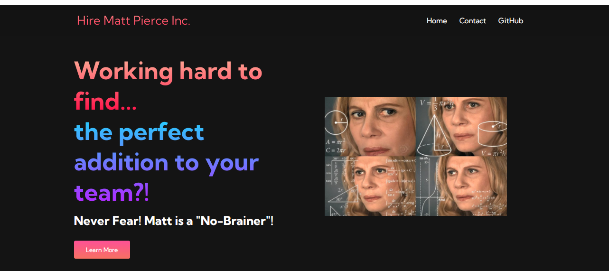
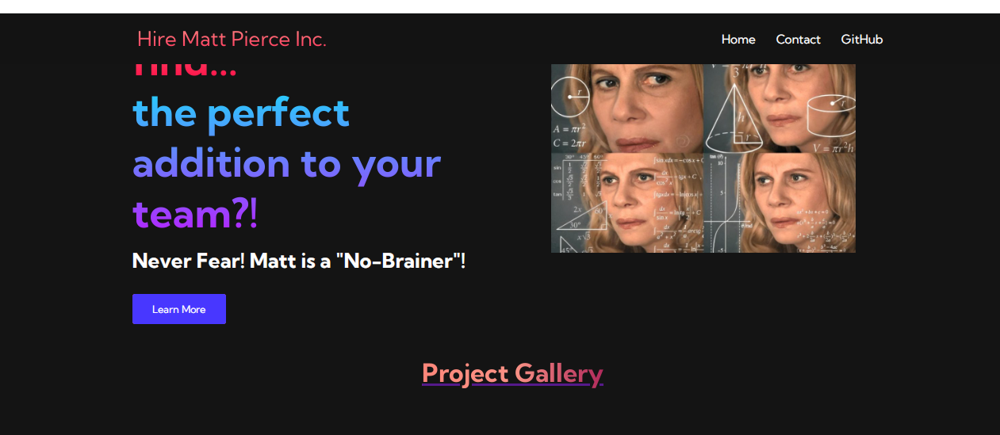
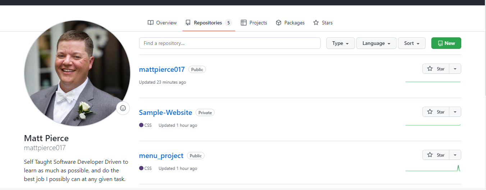
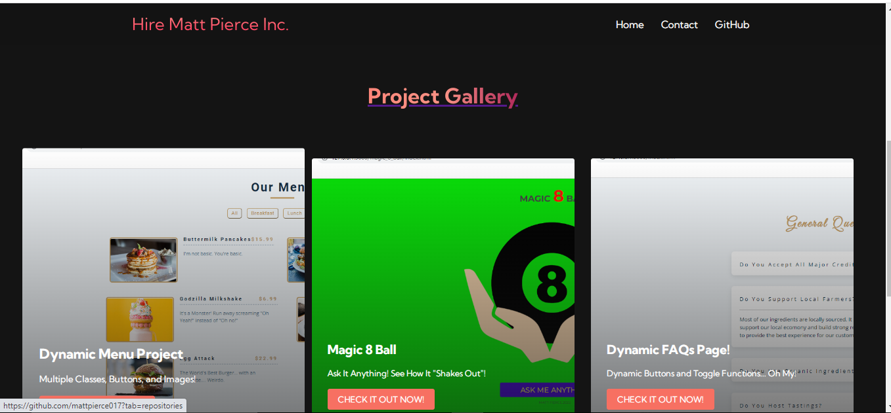
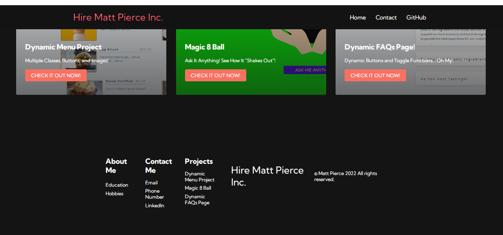

<h1>Sample Website</h1>

<h2>Description</h2>
Project consists of JavaScript Functions, and classes set in HTML files. This is my first attempt at creating an entire site. The purpose of the site is to showcase my projects I have set up in my GitHub Repos.
 

<h2>Languages and Utilities Used</h2>

- <b>JavaScript, CSS, HTML</b> 
- <b>Github, Images</b>

<h2>Environments Used </h2>

- <b>Windows 10</b> (21H2)

<h2>Program walk-through:</h2>

Home Page:  

 
 
Click First Button:   

 
 
Link To GitHub:  

 
 
Scroll Down To Gallery and Click on Check It Out Now!:   

 
 
Scroll Down to Footer That also has redirecting buttons:   

 
 
Check Out Contact Page:   

 
 
Follow the link to connect with me on LinkedIn!:   

 
